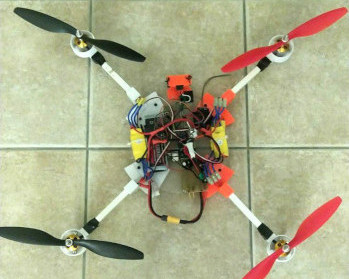
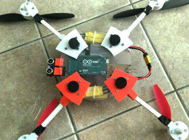

# Arduino quadcopter

A simple quadcopter filght controller designed to work in angle control mode ([diagram](https://docs.px4.io/v1.12/assets/img/mc_control_arch.21116ef0.jpg)).  
All parameters are grouped in `config.h`.  
Switch `OPERATING_MODE` to perform ESC calibration and IMU calibration.  
Switch `DEBUG` to visualize print messages in the serial monitor.  
The control loop frequency is about 80Hz.

## Software requirements
Arduino libraries:
- MPU9250==0.4.8
- AutoPID==1.0.3

## Hardware requirements
- Board: Arduino Mega 2560
- Imu: MPU 9250
- Receiver: Flysky FS-IA6 
- Motor/ESC: A2212 1000KV Brushless Motor 30A ESC 
- Propeller: 1045
- Rangefinder: HC-SR04
- Battery: LiPo 3S 35C XT60
- DC/DC stepdown: LM7805
- 30A fuse

## Frame
- 4x motor.stl
- 4x holder.stl
- 4x hollow alluminium rod 10x10x130 mm (to link motor and holder)
- 1x plastic disk diameter ~220 mm (the base where to anchor holders with 3M bolts)
- 1x cover.stl

## TODO:
- test altitude control
- include reversed imu in rotation